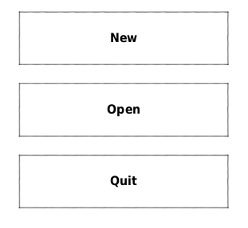
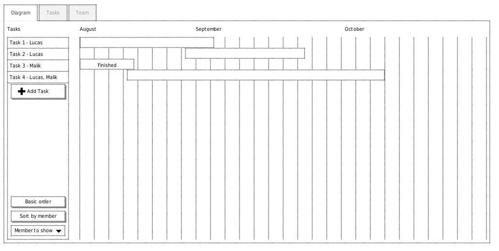
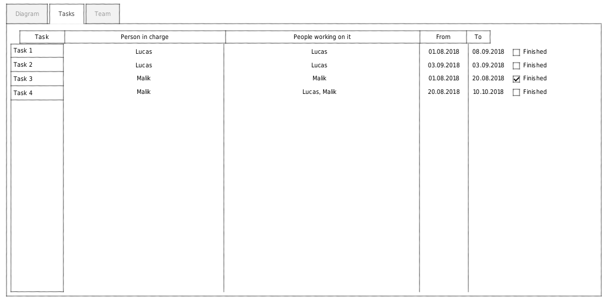
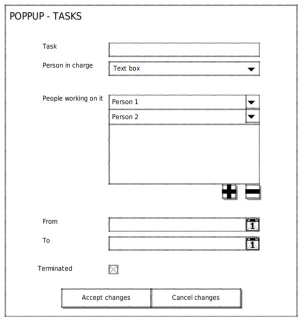

\newpage

\tableofcontents

\newpage

# Introduction

Pour ce projet d'HES d'été 2018, le but sera de développer une application web desktop avec le framework Electron. L'application sera donc développée en HTML/CSS et Javascript. Ce document listera les fonctionnalités détaillées de cette application.

L'application, nommée ElectroGantt, sera graphique et permettra de faire des diagrammes de Gantt simple et de gérer une liste de tâches. Les données créées par l'utilisateur seront ensuite enregistrer dans un fichier local type JSON ou XML.

## Electron

Elecron permet le développement d'application graphique desktop en utilisant des technologies frontend et backend originellement faites pour des application web. Notamment avec Node.js pour le backend et Chromium pour le frontend.

https://en.wikipedia.org/wiki/Electron_(software_framework)

## Lien de la forge

 - https://github.com/bull0n/electroproject

# Fonctionnalités essentielles

Cette liste de tâches est les tâches qui devront être faites pour remplir les objectifs finaux de l'application

## Ouverture du programme

Lorsque le programme est ouvert, il va ouvrir le dernier fichier ouvert. S'il n'y en a pas ou que le fichier n'existe plus. Il y aura un écran très simple avec 3 boutons, Nouveau, Ouvrir et Quitter. La sauvegarde des derniers fichiers ouverts seonrt stockés dans un fichier se trouvant dans le répertoire de l'application. Ce fichier sera un JSON pour la raison que c'est un fichier texte et que c'est facilement editable.

\clearpage

## Afficher un diagramme et sa liste de tâches

Afficher la liste des tâches sous forme de digramme de Gantt. Chaque tâches aura une couleur en fonction de la personne responsable. Mais une couleur autre peut être spécifiée.
Il sera également possible d'ajouter / modifier des tâches et leur date de début/fin directement sur le diagramme de Gantt.
Il sera également possible de trier (uniquement à l'affichage) les tâches par utilisateur ou d'afficher uniquement les tâches d'un utilisateur.

### Diagramme

\clearpage

### Liste de tâches (page de tâches)

La page de tâches comporte la liste des tâches existantes ainsi que des boutons permettant la gestion de cette liste de tâches. L'affichage de cette liste se fera à l'aide d'une table HTML. Les tâches se trouvant dans cette liste sont sélectionnables afin de pouvoir les modifier ou les supprimer (ce qui entrainera l'ouverture d'une fenêtre modale). Au fond de la page se trouvera également un bouton permettant l'insertion d'une nouvelle tâche la liste.

\clearpage

## Equipe

La page d'équipe permet d'afficher une liste de personnes ainsi que des boutons permettant la gestion de cette liste. L'affichage de cette liste se fera à l'aide d'une table HTML. Il sera possible de sélectionner une personne dans cette liste afin de pouvoir modifier ou supprimer ses informations (couleur et nom associé à la personne). Il sera également possible d'ajouter une nouvelle personne dans cette liste en appuyant sur un bouton se trouvant au fond de la page.

Les informations relatives à une personnes sont les suivantes:
- la couleur (permet d'identifier de manière rapide à qui est associé une tâche)
- le nom de la personne

Ces données sont stockées dans un fichier qui comportera également les autres informations (nom du projet, liste de tâches et les informations relatives au diagramme).

\clearpage

## Créer une liste de tâches

Il sera possibilité de créer ou d'éditer une tâche à l'aide d'une fenêtre de type modale. Les tâches ont plusieurs données telles que :

- Responsable
- Personne travaillant sur la tâche
- Date de début et de fin
- Status (terminé / pas terminé)

Cette liste de personne sera stocké dans le fichier du projet qui comporte toutes les autres données comme mentionné au point précédent.

## Sauvegarder dans un fichier

Le projet sera sauvegardé dans un fichier JSON. Ce format texte est très adapté aux applications Javascript et le format texte permet d'éditer facilement le fichier. En plus de permettre l'historique du fichier via Git.

L'utilisateur pourra choisir où stocker son fichier sur le disque à l'aide d'une boîte de dialogue prévu à cet effet.

Le fichier comportera toutes les informations relatif à un projet. C'est-à-dire qu'il contiendra:
- la liste des membres de l'équipe
- la liste des tâches
- le nom du projet
- les autres informations relatives au diagramme de GANTT

# Fonctionnalités optionnelles

Cette liste de tâches est contient les tâches qui seront réalisées s'il y a du temps à disposition et ne fait donc pas partie des objectifs du résultat final.

## Interface git

Cette interface comportera plusieurs boutons et champs qui devront être remplis avant de pouvoir utiliser cet utilitaire.

- un champs "Account": l'utilisateur doit insérer son nom de compte GIT
- un champs "Password": l'utilisateur doit insérer son mot de passe GIT
- un champs "Repository": l'utilisateur doit insérer le lien du repo.
- un bouton de COMMIT et PUSH: l'utilisateur peut push les modifications de son GANTT

Concernent le PULL, il y a deux possibilités qui s'offrent à nous, dont nous n'avons pas encore fait de choix:

- vérification sur le repository si le fichier actuel est à jour ou non (événement qui se lance tous les x minutes)
- vérification et chargement du fichier de manière manuelle (en cliquant sur le bouton PULL dédié à cela)

## Zoomer sur la vue du diagramme de Gantt

Cette fonctionnalité permettra d'afficher le diagramme sur une largeur choisie par l'utiliseur (Par ex: Afficher le calendrier par mois, jours, semaines ...).
Pour effectuer cette action, nous prévoyons de le faire à l'aide d'un raccourci clavier (exemple: ctrl + molette, à voir selon possiblité avec Electron).

## Récapitulatif d'avancement du projet

Une page permettant de voir rapidement l'avancement du projet. Elle pourra comporter les informations suivantes :
- les tâches à commencer
- les tâches qui sont en cours
- les tâches qui sont en retard
- les tâches terminées

## Organiser les tâches par groupe

Faire une système de groupe qui permettra de mettre les tâches dans un groupe et de faire une arborescence. Par exemple :

- Groupe 1
  - Tâche 1.1
  - Tâche 1.2
  - Groupe 1.1
    - Tâche 1.1.2
- Tâche 1

Il sera possible de presser sur un groupe afin de rendre visible/invisible les tâches liées à ce groupe.
